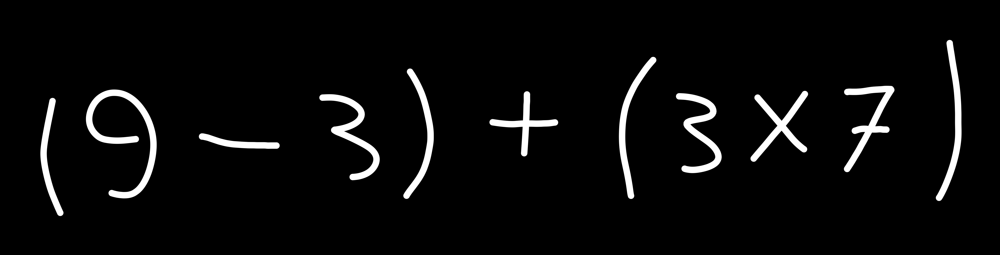

# Reconhecimento e Avaliação de Expressões Matemáticas com IA

Este projeto utiliza inteligência artificial para reconhecer e avaliar expressões matemáticas a partir de imagens. Ele combina o poder do modelo [TrOCR](https://huggingface.co/microsoft/trocr-large-printed) da Hugging Face para OCR (Reconhecimento Óptico de Caracteres) com uma interface gráfica simples e intuitiva criada com [Gradio](https://gradio.app/).

## Funcionalidades

- **Reconhecimento de texto em imagens**: O modelo TrOCR é usado para identificar e transcrever expressões matemáticas em imagens.
- **Correção automática de caracteres ambíguos**: Substitui caracteres como `x` por `*` e `O` por `0` para melhorar a precisão.
- **Validação e avaliação de expressões**: Verifica a validade da expressão e calcula o resultado.
- **Interface gráfica amigável**: Permite que o usuário carregue imagens e visualize os resultados diretamente.

## Como funciona?

1. O usuário carrega uma imagem contendo uma expressão matemática.
2. O modelo TrOCR processa a imagem e extrai o texto.
3. A expressão é corrigida e validada para garantir que seja computacionalmente válida.
4. O resultado da expressão é calculado e exibido ao usuário.

## Tecnologias Utilizadas

- **[Hugging Face Transformers](https://huggingface.co/transformers/)**: Para o modelo TrOCR.
- **[Gradio](https://gradio.app/)**: Para criar a interface gráfica.
- **[Pillow](https://python-pillow.github.io/)**: Para manipulação de imagens.
- **Python**: Linguagem principal do projeto.

## Como executar o projeto?

### Pré-requisitos

Certifique-se de ter o Python 3.8 ou superior instalado. Além disso, instale as dependências necessárias:

```bash
pip install torch transformers gradio pillow
```

### Executando o projeto

1. Clone este repositório:

```bash
git clone <URL_DO_REPOSITORIO>
cd projeto_gradio
```

2. Execute o script principal:

```bash
python main.py
```

3. Acesse a interface gráfica no navegador pelo link exibido no terminal (geralmente `http://127.0.0.1:7860`).

## Exemplo de Uso

1. Carregue uma imagem como esta:

   

2. O sistema exibirá:

   ```
   Expressão reconhecida: (9-3) + (3X7)
   Expressão corrigida: (9-3)+(3*7)
   Resultado: 27
   ```

## Estrutura do Projeto

```
projeto_gradio/
├── main.py          # Código principal do projeto
├── README.md        # Documentação do projeto
└── requirements.txt # Dependências do projeto (opcional)
```

## Licença

Este projeto está licenciado sob a [MIT License](LICENSE).
